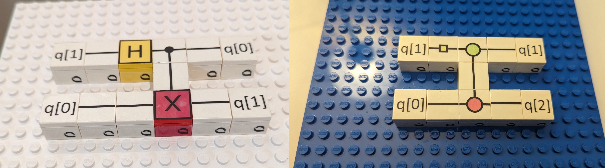
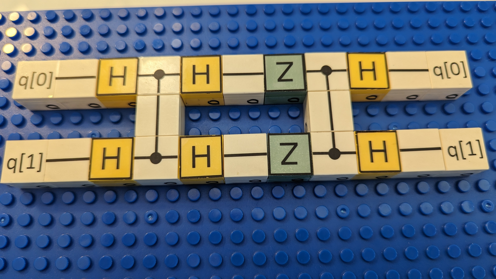
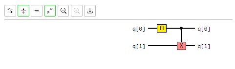
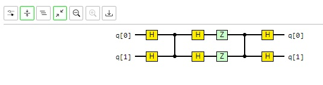

![Quantinuum_logo](data:image/png;base64,iVBORw0KGgoAAAANSUhEUgAAAIIAAABLCAMAAACLOq%2BzAAACx1BMVEUAAAAAAP%2BAgIBVqqqAgIBmmZmAgKptkpKAgJ9xjo6AgJl0i6JqgJV2iZ1tgJJ3iJlwgJ94h5ZxgJx5hpRzgJl5hp50gJdvhZt1gJVwhZl2gJ12gJtyhJV3gJlzhJx4gJd0g5txgJZ1g5lxgJx1g5hygJp2g5ZzgJl2g5tzgJh3gpp0gJdxgpl0gJtygph1gJpygpd1gJlzgpt2gJhzgpp2gJd0gplygJt0gphygJp1gpdzgJl1gptzgJh1gpp2gZl0gJtygZh0gJpzgZh1gJlzgZp1gJhzgZp1gJh0gZl0gZhygJp0gZhzgJl0gZpzgJh1gZpzgJh1gZl0gJp1gZh0gJp0gJlzgZp0gJhzgZp1gJhzgZl1gJp0gZh1gJp0gZhzgJl0gZpzgJlzgJh1gZlzgJp1gZl1gZh0gJl0gJlzgZl0gJhzgZl1gJp0gZl1gJl0gZh1gJl0gZpzgJl0gZlzgJh0gZlzgJp0gZl0gJl1gJh1gJpzgJl0gJhzgJl0gJpzgJl0gJl1gJl0gJp1gJl0gJl1gJhzgJp0gJlzgJl0gJh0gJl1gJp0gJl1gJl0gJh1gJl0gJpzgJl0gJlzgJh0gJl0gJp0gJl0gJl1gJh0gJl1gJp0gJlzgJl0gJh0gJl0gJp0gJl0gJl0gJh1gJl0gJpzgJh0gJl0gJl0gJl1gJp0gJl1gJl0gJhzgJl0gJl0gJl0gJh0gJl0gJp0gJl0gJl1gJh0gJlzgJp0gJl0gJl0gJl0gJl0gJl0gJl0gJl0gJl1gJl0gJlzgJl0gJl0gJl0gJl0gJl0gJl0gJl0gJl1gJl0gJlzgJl0gJl0gJl0gJl0gJl0gJl0gJl0gJl0gJl1gJl0gJl0gJl0gJl0gJl0gJl0gJl0gJl0gJl0gJl0gJl0gJl0gJl0gJl0gJl0gJl0gJl0gJl0gJl0gJl0gJl0gJn%2F%2F%2F%2Bc0JCdAAAA63RSTlMAAQIDBAUGBwgJCgsMDQ4PEBESExQVFhcYGRocHR4fICEiIyQlJicoKSorLC0uLzAxMjM0NTY3ODk6Ozw9Pj9BQkNERUZHSElKS01OT1BRUlNUVVZXWFpbXF1eX2BhYmNkZWZoaWprbW5wcXJzdHV2d3h5ent8fX5%2FgIGDhYaHiImKjI2Oj5CSk5SVlpeYmZqbnJ2en6ChoqOkpaanqKmqq6ytrq%2Bws7a3ubq7vL2%2BwMHCw8TFxsfIycrLzM3Oz9DR0tPU1dbY2drb3N3e3%2BDh4uPk5ebn6Orr7O3u7%2FHy8%2FT19vf4%2Bfr7%2FP3%2B7Jw5zgAAAAFiS0dE7CG5sxsAAAVfSURBVBgZ7cGNV9X1AcfxNxcwnhRRaVCsKGszI%2BbDcs3KlDKldAmhGywz0ZyJOqLUHrBraVoKJD5E%2BBDaarXS2tZ0jmkqKjlLKR9SA6EFCNzPP7Hv7%2F7QmMm9nM754jkdXi9%2BsNCxL7x9uLb266qKZx%2BI5Ar4yYsn9J2GNyd46F6e%2BfW6RFWmh2404ANdxq6f022uOajL%2BvYPIXSPyN3qTFkY1vUBytW5tyOwLHE%2BjFMg73iwKqpyCCEHFFAhVpXsgfEKzJeBRWO1CDYpiK%2FisCbsU91N%2BDkFU4Q1WVIkqWrX%2BvGTv04Ih96Dp246o47aUrBlpxogR351z8XzHc%2F4j9TBGiz5lVQD82W0Lo7lErfv0EWN8dixTDoICyTV3Mn3heY36YK52LFf%2BgLypH%2FHcVlDT6vddqxI8EnfQLb29qMTg0%2FJ1RSNDQ%2FJiGJEVTydGlQv1%2F3YMEdGGp4BBJAt1xPYsFTGYoLYIL8l2LBZRhVBJDXJ8TI2%2FEmOewhilRwrsGGDHO8QxI1yvIgNa%2BQ3hiCqZCzChmXyq76KwBbLmIsN0%2BQqIbAHZEzGhmFql0dAKTKSsCGiRa622QQSI6kGO7bpgqWhBNAgrcSOabroX7fRuQ8%2Fqx6JHX2bdNH55ddxJZSrg5aNE6Lpdre06v80bnvVW5DfbnZuR6OxZKW6qhxL%2Btaoi97Altub1TWvY81jPnXJeuzJV5esw6LHW9UFa7Ep%2FayCK8Wqaz9QUKux7OFjCqIE28If2aeAiukGtxX%2B47w6VUT3iBg8Mdc1K%2F8S99GjR48ePXr06PHjkzRjycIxHhyR0%2BNwxOT0wxH64G%2F74xrzaDR%2B9%2F4SeDDzghDwZCZh3PdoJH7jhgLXZobhiH84Aph4E36TBgGpmem0S52eDuFLz8vYPwRjiMbj%2BJlycGRLr%2BKq1N964zi0HqjXBTEQockYB7UtGsexImCSYnHMVCJQl4cjwrcAWCaNxy%2F2tE4SskXb74i%2B5omGhhRgpDJwpGgGRtjhszuarsNvd5t2xmJ8XgYMHZ2WdqQuLS1tWBhEaQrGoTb9tTfGVyXAJF2NI0%2BJQF0Bjr5aACz31X%2FaC8cSfXOWDK0LwfjFt7tC4E49gmOEpmFMVW5KSyl%2Be%2F68QJX9gFPluHafwBWj32FUbynUjljg3GrgIf0UR74SgbrncAzQ08CKs7M0DyO56d2t9Ww%2FFYPfUxoOqZqN435lAeGf7fVQ0jIQx97NzNG%2BBKjbiKvyGK4%2BysE4vJYC7Y6H5lJgggbheF6JwJmXcFyvfOCVk6H7ziUAFa23ljdzeg2uFM2CG7QQxxSNA6ZrEiS3lOPYvwHm6EgyjZtx7TqCq69%2Bj3FkNTyp6iSP1gLpugvHMiUCp9bjSFEesPILRqkM7tFrlLbS8Bqu6%2FVHCP36n6EYmxv7QK9jenxKVu6J1sEYB8qAuTpxq68C18fVuOI0FePzYqBANalaDyRrHUbvmuO9gA%2FPxGE8rVFA0VHY4rsr7EBDAkUtHNiJK10ZwHy9lUD0cnmBmWq3FeNQGUaBarUV1%2FYqXP01DeNoMcYi1aoMY5MKI0neoRyMe31%2Fv5FeeS0fhQAlR2Fg8755WgirmnlWo%2FCLHRgKeFZIdY16Ixyu%2BrJy%2BDBHqW8IUF2G4xnpLVzvfYIrXtMxaopxPC%2BVY8T8ReePy1eI38xmX81%2FtedqjNVHgZfV9mUUrGok%2FvjpsXQ0svj90jSMG7zD8Yt%2BZiwwLwu%2FXG82rqzHcMV4R2AU%2FAa%2FGd7JOEImvv7e8mG0u3nJuxuzw3Fk5AP9vd7RwMQCGPQfHayoKClZ6R3FlRJV8MnJ2trG2trZXBH%2FA2RBOeTINIkQAAAAAElFTkSuQmCC)<br>

#  pyTKET Bricks

The pyTKET bricks are a hands-on and fun way to familiarize yourself with well-known quantum circuits. Assemble the bricks to represent a Bell State or Grover's algorithm example. The brick color code and design is based on the [pyTKET](https://cqcl.github.io/pytket/manual/index.html) circuit rendering tool. PyTKET is the python wrapper of [TKET](https://www.quantinuum.com/developers/tket), Quantinuum's open-source quantum SDK. 

We hope you enjoy pyTKET bricks by yourself, with friends, or with your family!


## Sample circuits you can assemble with pyTKET bricks

### 1) Bell state example

The pyTKET bricks can be arrange to represent a Bell state or Bell pair, after physicist John Stewart Bell. [It entangles two qubits.](https://en.wikipedia.org/wiki/Bell_state) 




### 2) Grover's algorithm example

Grover’s algorithm is a quantum search algorithm for an unstructured database, which was devised by Lov Grover in 1996. Here we use pyTKET bricks to assemble the 2-qubit [Grover’s algorithm](https://en.wikipedia.org/wiki/Grover%27s_algorithm) for the case |w>=|11>.



## Drawing a pyTKET circuit using python

[PyTKET](https://cqcl.github.io/pytket/manual/index.html) is a python module for interfacing with [TKET](https://www.quantinuum.com/developers/tket), a quantum computing toolkit and optimising compiler developed by Quantinuum.

Pytket is available for Python 3.8, 3.9 and 3.10, on Linux, MacOS and Windows. To install, run:

```shell
pip install pytket
```

Then import the pyTKET circuit class and circuit rendering tool:

```shell
from pytket import Circuit, OpType
from pytket.circuit.display import render_circuit_jupyter
```

Then for the Bell state circuit run:
```shell
bell = Circuit(2)
bell.H(0).CX(0,1)
render_circuit_jupyter(bell)
```


Similarily, to draw the Grover's algorithm example run:
```shell
grover = Circuit(2)
grover.H(0).H(1).CZ(0,1).H(0).H(1).Z(0).Z(1).CZ(0,1).H(0).H(1)
render_circuit_jupyter(grover)
```


## Run the sample circuits on a state vector simulator

This example shows how to use pyTKET to execute the Bell state example on the `AerStateBackend` simulator. First install the pytket-qiskit backend extension

```shell
pip install pytket-qiskit
```

and then run:

```shell
from pytket.extensions.qiskit import AerStateBackend
import numpy as np

backend = AerStateBackend() #initialize backend with default settings
result = backend.run_circuit(bell) #interface for running circuit on a given backend to obtain results
result_state = result.get_state() #for results we get the full state vector of the output
print(f"State vector -> {np.round(result_state, 3)}")   # prints (0,0), (1,0), (0,1), (1,1) states
```

Which should give you as output:
`State vector -> [0.707+0.j 0.   +0.j 0.   +0.j 0.707+0.j]`

```math
\left| \psi \right\rangle = \frac{1}{\sqrt{2}} \left( \left| 00 \right\rangle + \left| 11 \right\rangle\right)
```
